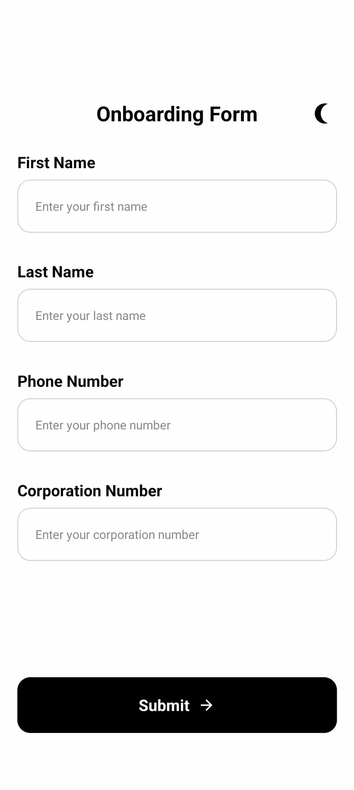

# Onboarding Form App

<p align="center">
  
</p>

A React Native onboarding form with dark/light mode support, form validation, and reusable components.

## Features

- **Dark Mode & Light Mode** – Toggle and save theme preferences using **Zustand**.
- **Form Handling & Validation** – Built with **React Hook Form** and **Yup**.
- **API Validation** – 'Corporation Number' field is validated via API before submission.
- **Form Submission** – Submits form data to an API and displays appropriate responses.
- **Network Requests** – Managed with **Axios**.
- **Custom Hooks & Reusable Components** – Modular and maintainable code structure.
- **Testing** – using **@testing-library/react-native**.

## Installation

```bash
npm install
```

```bash
npm run android
```

## Running Tests

```bash
npm test
```


